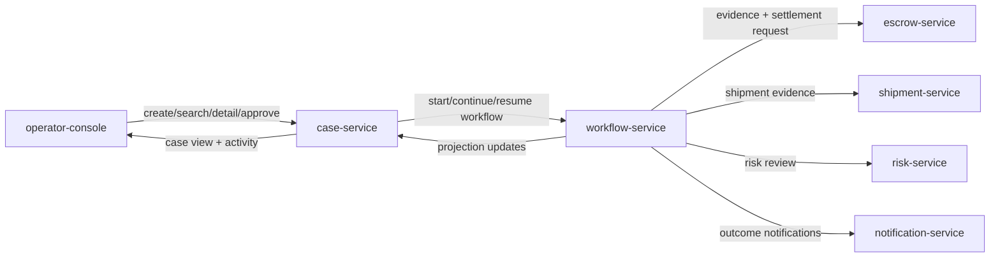
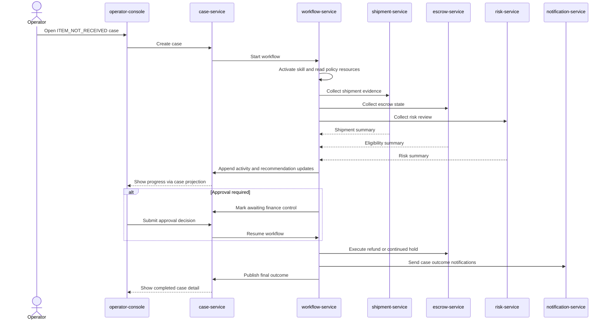

# Marketplace Agent Platform Concept

This note captures the concept direction for the next high-density Arachne sample.

It is intentionally a concept document, not an implementation plan. The immediate goal is to decide what kind of sample should exist before deciding how much code, how many modules, or how much infrastructure the sample should carry.

Requirements are tracked separately in [requirements.md](/home/akring/arachne/marketplace-agent-platform/docs/requirements.md).
Execution and development structure are tracked separately in [architecture.md](/home/akring/arachne/marketplace-agent-platform/docs/architecture.md).

## Goal

The sample should demonstrate the core Arachne idea in a form that is easy to explain:

- multiple Spring-based microservices each own a service-local agent
- those agents collaborate through explicit capability boundaries
- deterministic Spring services still own correctness-sensitive state transitions
- value emerges from cross-service agent coordination rather than from one oversized prompt

The sample should therefore show both of these at once:

1. service architecture and agent architecture mirror each other
2. Arachne capabilities become useful at the seams between services, approvals, policy, and long-running workflows

The backend remains the architectural center, but the sample should also include a thin operator-facing frontend so streaming and human approval are visible in a realistic way.

## Domain Choice

The preferred domain is a high-value marketplace platform with escrow-mediated settlement and exception handling.

The sample should be broad enough to support several marketplace workflows, while still being explained through one representative scenario.

Representative explanation scenario:

- a buyer reports that an item did not arrive
- the seller claims it was shipped
- funds are currently held in escrow
- the platform must inspect shipping evidence, payment state, and risk signals before deciding whether to release funds, keep the hold, or refund the buyer

This is preferred over direct trade-finance terminology because it preserves the same structural idea while remaining easier to understand as a sample.

## Why This Domain Fits Arachne

This domain naturally requires separate responsibilities:

- case management and projection
- workflow orchestration
- escrow and settlement state
- shipment evidence inspection
- risk and compliance review
- customer-facing or operator-facing notification

It also supports multiple business cases without changing the service model:

- dispute handling
- refund and settlement control
- shipment exception review
- high-risk order hold and release
- seller-side cancellation follow-up

Those responsibilities map well to service-local agents and deterministic service backends.

The domain also naturally justifies:

- policy and runbook lookup
- typed evidence summaries
- approval before high-value settlement actions
- session restore across a paused workflow
- operator-visible streaming progress
- steering that blocks unsafe fast paths

## Conceptual Scope

The sample should be broader than a single workflow but explained through one representative case.

Implementation scope target:

- capable of modeling several escrow exception paths
- demonstrated first through one main end-to-end case

Primary explanation case:

- item-not-received dispute under escrow

Possible future extension cases:

- delivered but damaged
- partial refund after evidence review
- high-risk order kept on hold pending manual review
- seller-side cancellation after payment authorization

## User Experience Shape

The sample should use only two operator-facing screens.

This is enough to make the backend workflow understandable without turning the sample into a UI-heavy application.

### `Case List`

Purpose:

- list existing marketplace cases
- support `Agentic Search` across cases and key attributes
- allow the operator to start a new case
- allow navigation to the selected case detail

This screen should make it clear that the sample supports multiple case types, not only the representative dispute scenario.

### `Case Detail`

Purpose:

- allow the operator to create or continue work on a case through chat
- show structured case attributes and current status
- show summarized evidence returned by service-local agents
- show work history and streamed activity updates
- show pending approval state and allow approval submission
- show the final settlement outcome once the workflow completes

The chat is an entry point and control surface, not the entire UX. The main value should come from seeing how agent collaboration updates the case.

The detailed UX and behavior requirements for screens, regions, and visible Arachne capability usage are tracked in `requirements.md`.

## Logical Service Topology

The current leading topology is six backend services plus a thin operator frontend.

The following overview is meant to help a reviewer orient around ownership before reading the service-by-service details.

### `operator-console`

Responsibility:

- start representative workflows
- show the case list and agentic search results
- show streamed progress and evidence checkpoints
- show pending approval state clearly
- submit approval decisions back into the backend

This frontend should remain intentionally thin. It exists to reveal Arachne behavior rather than to become the main subject of the sample.

### `case-service`

Responsibility:

- create marketplace cases
- serve case list, case detail, and agentic search results
- own durable operator-facing case projections
- serve activity history, approval state, and outcome views
- start and continue workflows through internal workflow-service calls

Agent role:

- `case-agent`

### `workflow-service`

Responsibility:

- own the dispute workflow lifecycle
- activate the appropriate skill
- gather evidence from other services through stable capability-oriented tools
- read policy and runbook resources
- produce a typed recommendation
- pause for approval when required
- resume and finalize the workflow later
- update case-service projections as the workflow advances

Agent role:

- `case-workflow-agent`

### `escrow-service`

Responsibility:

- own escrow balance, hold state, settlement eligibility, and refund execution

Agent role:

- `escrow-agent`

### `shipment-service`

Responsibility:

- own shipment milestones, tracking evidence, and delivery-confidence interpretation

Agent role:

- `shipment-agent`

### `risk-service`

Responsibility:

- own fraud indicators, policy thresholds, and manual-review triggers

Agent role:

- `risk-agent`

### `notification-service`

Responsibility:

- own participant-facing and operator-facing notifications after a decision is made

Agent role:

- `notification-agent`

## Representative End-To-End Workflow

The first demonstrated workflow should be intentionally concrete and easy to narrate.

The same representative path is easier to review visually as an interaction sequence.

Recommended flow:

1. an operator opens a dispute case for `ITEM_NOT_RECEIVED` through the frontend
2. `case-service` creates the case and starts the internal workflow
3. `case-workflow-agent` activates the dispute-handling skill for escrow cases
4. the workflow reads allowlisted policy and runbook resources using built-in resource tools
5. the workflow delegates evidence collection to `shipment-agent`, `escrow-agent`, and `risk-agent`
6. those agents return typed outputs summarizing evidence and eligibility
7. case activity and evidence checkpoints become visible in the frontend through case-service projections
8. steering blocks any unsafe attempt to settle immediately without the required evidence path
9. the workflow produces a provisional settlement recommendation
10. if the amount or risk level crosses a threshold, the workflow interrupts for approval and the frontend shows the pending decision state
11. the session is restored later and the case resumes after an approval decision is submitted through case-service
12. `escrow-service` executes the deterministic final action such as refund or continued hold and `notification-service` sends the resulting notices

The same UX shape should later support other marketplace workflows without requiring a different screen model.

## Arachne Capability Mapping

The sample should earn the label "full utilization" by making each major capability necessary rather than decorative.

### Named agents and delegation

- one named agent per microservice
- workflow-service calls other services through capability-oriented tools rather than by sharing one giant prompt
- case-service may use a narrower agent for case search interpretation without becoming a workflow owner

### Structured output

- evidence summaries and final recommendations should be typed Java records
- examples: shipment evidence summary, risk assessment, escrow settlement recommendation

### Skills

- workflow-service uses packaged skills for dispute-handling procedure
- case-service may use narrower skills for agentic case search and query interpretation
- skills encode the business workflow, not the deterministic state mutation logic

### Built-in resource tools

- runbooks, settlement policy, and approval thresholds should be read through `resource_list` and `resource_reader`
- the sample should not add a custom policy-reader tool unless the built-in tools prove insufficient

### Sessions

- the workflow must survive a pause before final settlement
- the restored runtime should retain the relevant context needed to complete the case

### Interrupt and resume

- approval should be required for high-value or high-risk cases
- resume should enter through the existing Arachne resume boundary, not a side channel
- the frontend should make the paused state and the later resume action visible to a human operator

### Streaming

- operator-visible progress should surface evidence gathering, tool activity, retry, and completion in the frontend timeline

In the sample UI this should appear as readable activity entries in the case detail screen, not as raw model protocol output.

### Steering

- steering should block a shortcut path such as immediate settlement without evidence validation
- the guided path should remain narrow, explicit, and visible in stream output

### Execution context propagation

- operator identity or authorization context should propagate across delegated tool execution
- authorization failures should stay deterministic and explicit

The current workflow demonstrates this by restoring operator authorization context into parallel workflow-tool probes before recommendation shaping, while deterministic downstream settlement authorization remains enforced in `escrow-service`.

## UX Guardrails

The sample should avoid these traps:

- do not make the chat transcript the only source of truth for workflow state
- do not expose raw internal model messages when a clearer case-level summary exists
- do not add separate screens for approval, agent monitoring, or customer views in the first slice
- do not let the frontend become more complex than the backend workflow it is meant to reveal

## Architectural Direction

The sample should be treated as a real multi-service sample with a thin UI, not as one monolith pretending to have service boundaries.

### Maven structure

The likely target is a multi-module Maven project.

Candidate shape:

- parent sample aggregator
- shared contracts module for typed request and response records
- shared policy resources module if common packaged resources are needed
- one Spring Boot module per service
- one lightweight frontend module or workspace for the operator console
- optional integration-test module for end-to-end verification

### Runtime shape

The likely target is Docker Compose, but that should follow the logical service split rather than lead it.

Compose should primarily provide:

- service wiring
- frontend to backend wiring
- stable demo startup
- optional shared infrastructure such as Redis if session persistence across service restarts is required

The first implementation slice should avoid unnecessary infrastructure unless it proves necessary for the representative workflow.

## Guardrails For The Concept

The sample should not become a generic event-driven platform demo.

Keep these constraints:

- the main story is escrow dispute resolution, not generic workflow orchestration
- agent collaboration should mirror service collaboration
- deterministic application services own correctness-sensitive state changes
- the frontend should remain thin and operator-oriented
- the first slice should favor clear service boundaries over maximum infrastructure realism

## Questions To Resolve Before Implementation

No unresolved concept-level questions remain.

## Working Recommendations For The Next Design Step

The first concept and design pass has already fixed these defaults:

1. approval actor: `finance control`
2. representative first-slice outcomes: `REFUND` and `CONTINUED_HOLD`

## Current Recommendation

Proceed with this concept baseline:

- domain: marketplace agent platform with escrow-mediated settlement and exception handling
- representative case: `ITEM_NOT_RECEIVED` under escrow
- topology: six logical backend services with one named agent each, plus a thin operator frontend
- physical target: multi-module Maven plus Docker Compose, but only after the logical boundaries and first workflow are fixed