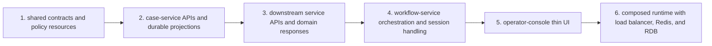
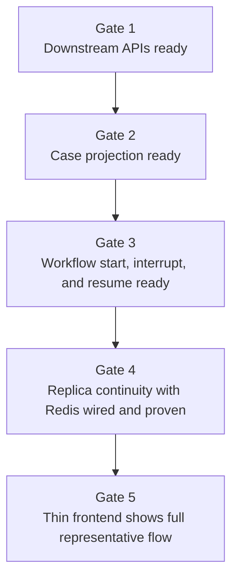

# Marketplace Agent Platform Implementation Slices

This note captures the recommended implementation sequence for the sample.

Use [requirements.md](/home/akring/arachne/marketplace-agent-platform/docs/requirements.md) for what the sample must support.
Use [architecture.md](/home/akring/arachne/marketplace-agent-platform/docs/architecture.md) for runtime and development structure.
Use [apis.md](/home/akring/arachne/marketplace-agent-platform/docs/apis.md) and [contracts.md](/home/akring/arachne/marketplace-agent-platform/docs/contracts.md) for the boundaries each slice should respect.
Use this file for the order in which the sample should be built.

## Slice Planning Rules

The implementation sequence should preserve these rules:

- each slice must leave the sample in a coherent, testable state
- a smaller runnable slice is preferred over a broader partially wired slice
- operator-visible workflow value matters more than early UI polish
- downstream business ownership must remain visible from the first slice onward
- new slices should add one kind of complexity at a time where practical

The following build-order view is intended to make the first slice easier to review as a dependency chain rather than a flat checklist.

## Slice 1

### Goal

Establish one end-to-end runnable `ITEM_NOT_RECEIVED` workflow with the full service shape, thin frontend, sessions, approval, and deterministic settlement completion.

### Must Include

- `operator-console`
- `case-service`
- `workflow-load-balancer`
- two `workflow-service` replicas
- `escrow-service`
- `shipment-service`
- `risk-service`
- `notification-service`
- Redis-backed workflow session continuity
- relational database-backed business state
- `Case List` and `Case Detail`
- case creation, case detail fetch, follow-up chat, status inquiry, SSE activity feed, and approval resume
- representative outcomes `REFUND` and `CONTINUED_HOLD`
- `finance control` approval path

### May Stay Simplified

- `agentic search` may remain case-service-led and basic
- `operator-console` may use a small `React + TypeScript + Vite` implementation without adding richer frontend architecture layers
- UI styling may remain intentionally thin and utilitarian
- downstream domain data may start from deterministic seed or stubbed integration data as long as service ownership boundaries remain intact
- notification delivery may be locally simulated while still remaining inside its own service

### Validation Checkpoints

- a new case can be created through the frontend and appears in `Case List`
- `Case Detail` shows structured summary, evidence, activity, approval state, and outcome without direct frontend calls to workflow-service or downstream services
- evidence gathering crosses shipment, escrow, and risk services through explicit service APIs
- approval interrupts and later resumes through the case-service to workflow-service path
- final settlement executes in `escrow-service`
- notification dispatch is triggered from `notification-service`
- successive workflow requests can hit different workflow-service replicas without losing workflow continuity

## Slice 2

### Goal

Harden the service-local agent behavior and skill boundaries after the first runnable slice is stable.

### Additions

- clearer packaged skills per service, especially `case-workflow-agent`
- stronger service-local evidence interpretation behavior in shipment and risk services
- cleaner separation between workflow skills and deterministic application services
- richer policy and runbook resource packaging

### Validation Checkpoints

- skill use remains visible and necessary rather than decorative
- steering remains narrow and readable
- workflow-service does not absorb downstream business logic while skills expand
- case-service does not absorb workflow decision logic while search and projections expand

## Slice 3

### Goal

Improve operator experience and query behavior without redrawing the service boundaries.

### Candidate Additions

- stronger `Case List` filtering and search behavior
- more polished activity presentation and evidence grouping
- clearer approval and outcome presentation
- better empty, loading, and resume states in the frontend

### Validation Checkpoints

- UI changes do not move business workflow logic into the frontend
- case-service API surface stays stable or changes in a controlled way

## Deferred Until After Slice 1

These items should not block the first runnable slice:

- broader case-type implementation beyond the representative flow
- more elaborate notification channels
- event broker adoption for cross-service coordination
- deeper skill taxonomy across all services

## Recommended Build Order Within Slice 1

1. shared contracts and shared policy resources
2. `case-service` case-facing APIs and durable projections
3. `escrow-service`, `shipment-service`, `risk-service`, and `notification-service` minimal APIs and domain responses
4. `workflow-service` orchestration, session handling, approval, and projection updates into case-service
5. `operator-console` thin UI against the case-service API
6. local composed runtime with workflow load balancer, Redis, and relational database

This order keeps business ownership explicit before orchestration and UI layering are added.

## Stop-And-Check Gates

These gates are also easier to read as a staged progression.

Do not expand implementation scope past a gate until the previous one is stable.

### Gate 1

Downstream services expose the minimal APIs and deterministic responses defined in [apis.md](/home/akring/arachne/marketplace-agent-platform/docs/apis.md).

### Gate 2

`case-service` can create, list, and serve a case projection using the contracts defined in [contracts.md](/home/akring/arachne/marketplace-agent-platform/docs/contracts.md).

### Gate 3

`workflow-service` can start, continue, interrupt, and resume a case workflow with finance control semantics intact.

### Gate 4

the full local composed runtime wires Redis-backed session restore and demonstrates workflow-service replica continuity across the internal load-balanced path.

### Gate 5

the thin frontend shows the complete representative flow with operator-visible activity and final outcome.