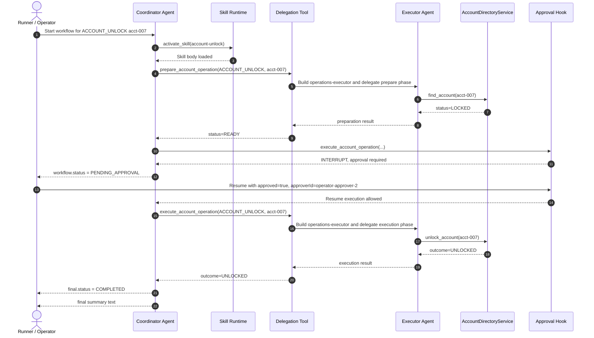

# Domain Separation Bedrock Demo Report

## Demo Purpose

This report records the Bedrock-backed demonstration run of the `domain-separation` sample.

The purpose of the demo is to show that the sample is not only a deterministic structural reference, but also a real AI-agent application in which:

- a Bedrock-backed coordinator agent activates a packaged skill
- the coordinator chooses capability-oriented tools
- work is delegated into a specialist executor agent
- the executor agent chooses concrete system tools
- the Spring-managed system layer actually performs the read and mutation work
- the workflow pauses at an approval boundary and later resumes to completion

## Application Architecture Prepared For The Demo

The demo application is a Spring Boot backend with two role-specific agent runtimes inside one process.

### Coordinator Side

- `operations-coordinator` is built at workflow execution time by `DomainSeparationWorkflowService`
- the coordinator receives packaged workflow skills from `domainSeparationCoordinatorSkills`
- the coordinator exposes a small capability-oriented tool surface:
  - `prepare_account_operation`
  - `execute_account_operation`
- the coordinator owns workflow state, approval handling, and session continuity

Relevant implementation files:

- `src/main/java/com/mahitotsu/arachne/samples/domainseparation/service/DomainSeparationWorkflowService.java`
- `src/main/java/com/mahitotsu/arachne/samples/domainseparation/runner/DomainSeparationRunner.java`
- `src/main/resources/skills/account-unlock/SKILL.md`

### Executor Side

- `operations-executor` is created by the coordinator-facing delegation tool when preparation or execution is needed
- the executor uses concrete system tools:
  - `find_account`
  - `unlock_account`
- those tools call the Spring-managed `AccountDirectoryService`

Relevant implementation files:

- `src/main/java/com/mahitotsu/arachne/samples/domainseparation/tool/AccountOperationDelegationTool.java`
- `src/main/java/com/mahitotsu/arachne/samples/domainseparation/tool/AccountSystemTool.java`
- `src/main/java/com/mahitotsu/arachne/samples/domainseparation/service/AccountDirectoryService.java`

### Observability Used For The Demo

The demo emits three classes of logs.

- `llm.trace>`: what the assistant requested or said
- `demo.trace>`: the visible workflow control flow
- `system.trace>`: actual system reads and mutations performed by the Spring service layer

The sample now also supports an optional deeper executor capture mode.

- `executor.llm.trace>`: the executor-side model request and response, including the delegated prompt, the effective system prompt, the latest tool result fed back into the executor turn, and the assistant tool selection / text for that executor turn

Relevant implementation files:

- `src/main/java/com/mahitotsu/arachne/samples/domainseparation/observation/DomainSeparationDemoLoggingListener.java`
- `src/main/java/com/mahitotsu/arachne/samples/domainseparation/workflow/DomainSeparationApprovalHook.java`
- `src/main/java/com/mahitotsu/arachne/samples/domainseparation/service/AccountDirectoryService.java`

## How The Application Was Executed

The Bedrock-backed demo was run from the sample directory with the Bedrock profile enabled and verbose executor capture turned on.

```bash
cd /home/akring/arachne/samples/domain-separation
mvn -Dstyle.color=never spring-boot:run -Dspring-boot.run.profiles=bedrock -Dspring-boot.run.arguments='--sample.domain-separation.demo-logging.verbose-executor=true' > bedrock-demo-capture.txt 2>&1
```

Environment assumptions for this run:

- Java 21
- Maven
- AWS credentials resolvable by the AWS SDK default credentials chain
- access to the configured Bedrock model in the target region

## Flow Overview

The main point of this demo is the control-flow separation across coordinator, executor, system layer, and approval boundary.



How to read this against the captured logs:

- `llm.trace>` shows the coordinator or executor deciding which tool to call next
- `demo.trace>` shows the workflow boundary crossings, delegation steps, approval interrupt, and resume
- `system.trace>` shows the actual read or mutation performed by the Spring-managed service layer
- the approval pause splits the flow into two coordinator turns: preparation before approval, execution after resume

## Actual Execution Result

The following is the actual console output from the Bedrock demo run, copied without omission from the captured command output.

```text
[INFO] Scanning for projects...
[INFO] 
[INFO] -----------< com.mahitotsu.arachne.samples:domain-separation >-----------
[INFO] Building Arachne Domain Separation Sample 0.1.0-SNAPSHOT
[INFO]   from pom.xml
[INFO] --------------------------------[ jar ]---------------------------------
[INFO] 
[INFO] >>> spring-boot:3.5.12:run (default-cli) > test-compile @ domain-separation >>>
[INFO] 
[INFO] --- resources:3.3.1:resources (default-resources) @ domain-separation ---
[INFO] Copying 2 resources from src/main/resources to target/classes
[INFO] Copying 4 resources from src/main/resources to target/classes
[INFO] 
[INFO] --- compiler:3.14.1:compile (default-compile) @ domain-separation ---
[INFO] Recompiling the module because of changed source code.
[INFO] Compiling 22 source files with javac [debug parameters release 21] to target/classes
[INFO] 
[INFO] --- resources:3.3.1:testResources (default-testResources) @ domain-separation ---
[INFO] skip non existing resourceDirectory /home/akring/arachne/samples/domain-separation/src/test/resources
[INFO] 
[INFO] --- compiler:3.14.1:testCompile (default-testCompile) @ domain-separation ---
[INFO] Recompiling the module because of changed dependency.
[INFO] Compiling 3 source files with javac [debug parameters release 21] to target/test-classes
[INFO] 
[INFO] <<< spring-boot:3.5.12:run (default-cli) < test-compile @ domain-separation <<<
[INFO] 
[INFO] 
[INFO] --- spring-boot:3.5.12:run (default-cli) @ domain-separation ---
[INFO] Attaching agents: []
2026-03-24T22:04:44.456+09:00  INFO 13294 --- [arachne-domain-separation-sample] [           main] i.a.s.d.DomainSeparationApplication      : Starting DomainSeparationApplication using Java 21.0.10 with PID 13294 (/home/akring/arachne/samples/domain-separation/target/classes started by akring in /home/akring/arachne/samples/domain-separation)
2026-03-24T22:04:44.459+09:00  INFO 13294 --- [arachne-domain-separation-sample] [           main] i.a.s.d.DomainSeparationApplication      : The following 1 profile is active: "bedrock"
2026-03-24T22:04:46.019+09:00  INFO 13294 --- [arachne-domain-separation-sample] [           main] i.a.s.d.service.AccountDirectoryService  : system.trace> account directory demo state reset: acct-007=LOCKED
2026-03-24T22:04:46.166+09:00  INFO 13294 --- [arachne-domain-separation-sample] [           main] i.a.s.d.DomainSeparationApplication      : Started DomainSeparationApplication in 2.29 seconds (process running for 2.575)
2026-03-24T22:04:46.169+09:00  INFO 13294 --- [arachne-domain-separation-sample] [           main] i.a.s.d.service.AccountDirectoryService  : system.trace> account directory demo state reset: acct-007=LOCKED
2026-03-24T22:04:46.169+09:00  INFO 13294 --- [arachne-domain-separation-sample] [           main] i.a.s.d.runner.DomainSeparationRunner    : Arachne domain separation sample
2026-03-24T22:04:46.169+09:00  INFO 13294 --- [arachne-domain-separation-sample] [           main] i.a.s.d.runner.DomainSeparationRunner    : phase> approval-backed session workflow
2026-03-24T22:04:46.169+09:00  INFO 13294 --- [arachne-domain-separation-sample] [           main] i.a.s.d.runner.DomainSeparationRunner    : supported.operations> [ACCOUNT_CREATION, PASSWORD_RESET_SUPPORT, ACCOUNT_UNLOCK, ACCOUNT_DELETION]
2026-03-24T22:04:46.170+09:00  INFO 13294 --- [arachne-domain-separation-sample] [           main] i.a.s.d.runner.DomainSeparationRunner    : workflow.id> account-unlock-approval-001
2026-03-24T22:04:49.172+09:00  INFO 13294 --- [arachne-domain-separation-sample] [           main] .d.o.DomainSeparationDemoLoggingListener : llm.trace> assistant requested tools: activate_skill
2026-03-24T22:04:49.174+09:00  INFO 13294 --- [arachne-domain-separation-sample] [           main] .d.o.DomainSeparationDemoLoggingListener : demo.trace> coordinator requests skill activation: account-unlock
2026-03-24T22:04:49.183+09:00  INFO 13294 --- [arachne-domain-separation-sample] [     virtual-36] .d.o.DomainSeparationDemoLoggingListener : demo.trace> skill activated: account-unlock
2026-03-24T22:04:49.814+09:00  INFO 13294 --- [arachne-domain-separation-sample] [           main] .d.o.DomainSeparationDemoLoggingListener : llm.trace> assistant requested tools: prepare_account_operation
2026-03-24T22:04:49.815+09:00  INFO 13294 --- [arachne-domain-separation-sample] [           main] .d.o.DomainSeparationDemoLoggingListener : demo.trace> coordinator calls prepare_account_operation for ACCOUNT_UNLOCK acct-007
2026-03-24T22:04:49.928+09:00  INFO 13294 --- [arachne-domain-separation-sample] [     virtual-41] i.a.s.d.t.AccountOperationDelegationTool : demo.trace> delegating prepare request to operations-executor for ACCOUNT_UNLOCK acct-007
2026-03-24T22:04:49.929+09:00  INFO 13294 --- [arachne-domain-separation-sample] [     virtual-41] i.a.s.d.t.AccountOperationDelegationTool : demo.trace> executor prepare prompt begin
2026-03-24T22:04:49.929+09:00  INFO 13294 --- [arachne-domain-separation-sample] [     virtual-41] i.a.s.d.t.AccountOperationDelegationTool : demo.trace> executor prompt | mode=prepare
2026-03-24T22:04:49.930+09:00  INFO 13294 --- [arachne-domain-separation-sample] [     virtual-41] i.a.s.d.t.AccountOperationDelegationTool : demo.trace> executor prompt | operationType=ACCOUNT_UNLOCK
2026-03-24T22:04:49.930+09:00  INFO 13294 --- [arachne-domain-separation-sample] [     virtual-41] i.a.s.d.t.AccountOperationDelegationTool : demo.trace> executor prompt | accountId=acct-007
2026-03-24T22:04:49.930+09:00  INFO 13294 --- [arachne-domain-separation-sample] [     virtual-41] i.a.s.d.t.AccountOperationDelegationTool : demo.trace> executor prompt | requestedBy=operator-7
2026-03-24T22:04:49.930+09:00  INFO 13294 --- [arachne-domain-separation-sample] [     virtual-41] i.a.s.d.t.AccountOperationDelegationTool : demo.trace> executor prompt | reason=Manual review completed
2026-03-24T22:04:49.931+09:00  INFO 13294 --- [arachne-domain-separation-sample] [     virtual-41] i.a.s.d.t.AccountOperationDelegationTool : demo.trace> executor prepare prompt end
2026-03-24T22:04:49.933+09:00  INFO 13294 --- [arachne-domain-separation-sample] [     virtual-41] .d.o.DomainSeparationDemoLoggingListener : executor.llm.trace> request begin
2026-03-24T22:04:49.933+09:00  INFO 13294 --- [arachne-domain-separation-sample] [     virtual-41] .d.o.DomainSeparationDemoLoggingListener : executor.llm.trace> system-prompt> You are the operations executor. Do not own business workflow or approval. For mode=prepare, inspect the current account state using the concrete system tools. For mode=execute, perform the requested mutation using the concrete system tools. Always return focused structured output.
2026-03-24T22:04:49.933+09:00  INFO 13294 --- [arachne-domain-separation-sample] [     virtual-41] .d.o.DomainSeparationDemoLoggingListener : executor.llm.trace> prompt | mode=prepare
2026-03-24T22:04:49.933+09:00  INFO 13294 --- [arachne-domain-separation-sample] [     virtual-41] .d.o.DomainSeparationDemoLoggingListener : executor.llm.trace> prompt | operationType=ACCOUNT_UNLOCK
2026-03-24T22:04:49.933+09:00  INFO 13294 --- [arachne-domain-separation-sample] [     virtual-41] .d.o.DomainSeparationDemoLoggingListener : executor.llm.trace> prompt | accountId=acct-007
2026-03-24T22:04:49.933+09:00  INFO 13294 --- [arachne-domain-separation-sample] [     virtual-41] .d.o.DomainSeparationDemoLoggingListener : executor.llm.trace> prompt | requestedBy=operator-7
2026-03-24T22:04:49.933+09:00  INFO 13294 --- [arachne-domain-separation-sample] [     virtual-41] .d.o.DomainSeparationDemoLoggingListener : executor.llm.trace> prompt | reason=Manual review completed
2026-03-24T22:04:49.934+09:00  INFO 13294 --- [arachne-domain-separation-sample] [     virtual-41] .d.o.DomainSeparationDemoLoggingListener : executor.llm.trace> request end
2026-03-24T22:04:50.748+09:00  INFO 13294 --- [arachne-domain-separation-sample] [     virtual-41] .d.o.DomainSeparationDemoLoggingListener : llm.trace> assistant requested tools: find_account
2026-03-24T22:04:50.748+09:00  INFO 13294 --- [arachne-domain-separation-sample] [     virtual-41] .d.o.DomainSeparationDemoLoggingListener : executor.llm.trace> response begin
2026-03-24T22:04:50.751+09:00  INFO 13294 --- [arachne-domain-separation-sample] [     virtual-41] .d.o.DomainSeparationDemoLoggingListener : executor.llm.trace> tools> find_account
2026-03-24T22:04:50.753+09:00  INFO 13294 --- [arachne-domain-separation-sample] [     virtual-41] .d.o.DomainSeparationDemoLoggingListener : executor.llm.trace> stop-reason> tool_use
2026-03-24T22:04:50.753+09:00  INFO 13294 --- [arachne-domain-separation-sample] [     virtual-41] .d.o.DomainSeparationDemoLoggingListener : executor.llm.trace> response end
2026-03-24T22:04:50.754+09:00  INFO 13294 --- [arachne-domain-separation-sample] [     virtual-41] .d.o.DomainSeparationDemoLoggingListener : demo.trace> executor runs find_account for acct-007
2026-03-24T22:04:50.797+09:00  INFO 13294 --- [arachne-domain-separation-sample] [     virtual-49] i.a.s.d.service.AccountDirectoryService  : system.trace> account directory lookup accountId=acct-007 observedStatus=LOCKED operatorId=operator-7
2026-03-24T22:04:50.842+09:00  INFO 13294 --- [arachne-domain-separation-sample] [     virtual-49] .d.o.DomainSeparationDemoLoggingListener : demo.trace> executor observed account status LOCKED
2026-03-24T22:04:50.843+09:00  INFO 13294 --- [arachne-domain-separation-sample] [     virtual-41] .d.o.DomainSeparationDemoLoggingListener : executor.llm.trace> request begin
2026-03-24T22:04:50.843+09:00  INFO 13294 --- [arachne-domain-separation-sample] [     virtual-41] .d.o.DomainSeparationDemoLoggingListener : executor.llm.trace> system-prompt> You are the operations executor. Do not own business workflow or approval. For mode=prepare, inspect the current account state using the concrete system tools. For mode=execute, perform the requested mutation using the concrete system tools. Always return focused structured output.
2026-03-24T22:04:50.843+09:00  INFO 13294 --- [arachne-domain-separation-sample] [     virtual-41] .d.o.DomainSeparationDemoLoggingListener : executor.llm.trace> prompt | mode=prepare
2026-03-24T22:04:50.843+09:00  INFO 13294 --- [arachne-domain-separation-sample] [     virtual-41] .d.o.DomainSeparationDemoLoggingListener : executor.llm.trace> prompt | operationType=ACCOUNT_UNLOCK
2026-03-24T22:04:50.843+09:00  INFO 13294 --- [arachne-domain-separation-sample] [     virtual-41] .d.o.DomainSeparationDemoLoggingListener : executor.llm.trace> prompt | accountId=acct-007
2026-03-24T22:04:50.844+09:00  INFO 13294 --- [arachne-domain-separation-sample] [     virtual-41] .d.o.DomainSeparationDemoLoggingListener : executor.llm.trace> prompt | requestedBy=operator-7
2026-03-24T22:04:50.844+09:00  INFO 13294 --- [arachne-domain-separation-sample] [     virtual-41] .d.o.DomainSeparationDemoLoggingListener : executor.llm.trace> prompt | reason=Manual review completed
2026-03-24T22:04:50.850+09:00  INFO 13294 --- [arachne-domain-separation-sample] [     virtual-41] .d.o.DomainSeparationDemoLoggingListener : executor.llm.trace> last-tool-result> {"accountId":"acct-007","currentStatus":"LOCKED","observedOperatorId":"operator-7"}
2026-03-24T22:04:50.851+09:00  INFO 13294 --- [arachne-domain-separation-sample] [     virtual-41] .d.o.DomainSeparationDemoLoggingListener : executor.llm.trace> request end
2026-03-24T22:04:51.755+09:00  INFO 13294 --- [arachne-domain-separation-sample] [     virtual-41] .d.o.DomainSeparationDemoLoggingListener : llm.trace> assistant requested tools: structured_output
2026-03-24T22:04:51.755+09:00  INFO 13294 --- [arachne-domain-separation-sample] [     virtual-41] .d.o.DomainSeparationDemoLoggingListener : executor.llm.trace> response begin
2026-03-24T22:04:51.757+09:00  INFO 13294 --- [arachne-domain-separation-sample] [     virtual-41] .d.o.DomainSeparationDemoLoggingListener : executor.llm.trace> tools> structured_output
2026-03-24T22:04:51.757+09:00  INFO 13294 --- [arachne-domain-separation-sample] [     virtual-41] .d.o.DomainSeparationDemoLoggingListener : executor.llm.trace> stop-reason> tool_use
2026-03-24T22:04:51.757+09:00  INFO 13294 --- [arachne-domain-separation-sample] [     virtual-41] .d.o.DomainSeparationDemoLoggingListener : executor.llm.trace> response end
2026-03-24T22:04:51.792+09:00  INFO 13294 --- [arachne-domain-separation-sample] [     virtual-41] i.a.s.d.t.AccountOperationDelegationTool : demo.trace> executor prepare response phase=PREPARE preparedStatus=READY authorizedOperatorId=operator-7
2026-03-24T22:04:51.794+09:00  INFO 13294 --- [arachne-domain-separation-sample] [     virtual-41] .d.o.DomainSeparationDemoLoggingListener : demo.trace> preparation returned status READY
2026-03-24T22:04:52.644+09:00  INFO 13294 --- [arachne-domain-separation-sample] [           main] .d.o.DomainSeparationDemoLoggingListener : llm.trace> assistant requested tools: execute_account_operation
2026-03-24T22:04:52.644+09:00  INFO 13294 --- [arachne-domain-separation-sample] [           main] i.a.s.d.w.DomainSeparationApprovalHook   : demo.trace> approval required before execute_account_operation can run; workflow interrupted
2026-03-24T22:04:52.645+09:00  INFO 13294 --- [arachne-domain-separation-sample] [           main] .d.o.DomainSeparationDemoLoggingListener : demo.trace> coordinator calls execute_account_operation for ACCOUNT_UNLOCK acct-007
2026-03-24T22:04:52.686+09:00  INFO 13294 --- [arachne-domain-separation-sample] [           main] i.a.s.d.runner.DomainSeparationRunner    : initial.status> PENDING_APPROVAL
2026-03-24T22:04:52.686+09:00  INFO 13294 --- [arachne-domain-separation-sample] [           main] i.a.s.d.runner.DomainSeparationRunner    : initial.approval.status> PENDING
2026-03-24T22:04:52.686+09:00  INFO 13294 --- [arachne-domain-separation-sample] [           main] i.a.s.d.runner.DomainSeparationRunner    : summary.operationType> ACCOUNT_UNLOCK
2026-03-24T22:04:52.686+09:00  INFO 13294 --- [arachne-domain-separation-sample] [           main] i.a.s.d.runner.DomainSeparationRunner    : summary.accountId> acct-007
2026-03-24T22:04:52.687+09:00  INFO 13294 --- [arachne-domain-separation-sample] [           main] i.a.s.d.runner.DomainSeparationRunner    : summary.preparation.status> READY
2026-03-24T22:04:52.698+09:00  INFO 13294 --- [arachne-domain-separation-sample] [           main] i.a.s.d.runner.DomainSeparationRunner    : session.restored.messages.beforeResume> 6
2026-03-24T22:04:52.700+09:00  INFO 13294 --- [arachne-domain-separation-sample] [           main] i.a.s.d.w.DomainSeparationApprovalHook   : demo.trace> workflow resumed with external approval: approved=true approverId=operator-approver-2
2026-03-24T22:04:53.542+09:00  INFO 13294 --- [arachne-domain-separation-sample] [           main] .d.o.DomainSeparationDemoLoggingListener : llm.trace> assistant requested tools: execute_account_operation
2026-03-24T22:04:53.543+09:00  INFO 13294 --- [arachne-domain-separation-sample] [           main] .d.o.DomainSeparationDemoLoggingListener : demo.trace> coordinator calls execute_account_operation for ACCOUNT_UNLOCK acct-007
2026-03-24T22:04:53.545+09:00  INFO 13294 --- [arachne-domain-separation-sample] [     virtual-51] i.a.s.d.t.AccountOperationDelegationTool : demo.trace> delegating execution request to operations-executor for ACCOUNT_UNLOCK acct-007
2026-03-24T22:04:53.546+09:00  INFO 13294 --- [arachne-domain-separation-sample] [     virtual-51] i.a.s.d.t.AccountOperationDelegationTool : demo.trace> executor execute prompt begin
2026-03-24T22:04:53.546+09:00  INFO 13294 --- [arachne-domain-separation-sample] [     virtual-51] i.a.s.d.t.AccountOperationDelegationTool : demo.trace> executor prompt | mode=execute
2026-03-24T22:04:53.546+09:00  INFO 13294 --- [arachne-domain-separation-sample] [     virtual-51] i.a.s.d.t.AccountOperationDelegationTool : demo.trace> executor prompt | operationType=ACCOUNT_UNLOCK
2026-03-24T22:04:53.546+09:00  INFO 13294 --- [arachne-domain-separation-sample] [     virtual-51] i.a.s.d.t.AccountOperationDelegationTool : demo.trace> executor prompt | accountId=acct-007
2026-03-24T22:04:53.546+09:00  INFO 13294 --- [arachne-domain-separation-sample] [     virtual-51] i.a.s.d.t.AccountOperationDelegationTool : demo.trace> executor prompt | requestedBy=operator-7
2026-03-24T22:04:53.547+09:00  INFO 13294 --- [arachne-domain-separation-sample] [     virtual-51] i.a.s.d.t.AccountOperationDelegationTool : demo.trace> executor prompt | reason=Manual review completed
2026-03-24T22:04:53.547+09:00  INFO 13294 --- [arachne-domain-separation-sample] [     virtual-51] i.a.s.d.t.AccountOperationDelegationTool : demo.trace> executor execute prompt end
2026-03-24T22:04:53.548+09:00  INFO 13294 --- [arachne-domain-separation-sample] [     virtual-51] .d.o.DomainSeparationDemoLoggingListener : executor.llm.trace> request begin
2026-03-24T22:04:53.548+09:00  INFO 13294 --- [arachne-domain-separation-sample] [     virtual-51] .d.o.DomainSeparationDemoLoggingListener : executor.llm.trace> system-prompt> You are the operations executor. Do not own business workflow or approval. For mode=prepare, inspect the current account state using the concrete system tools. For mode=execute, perform the requested mutation using the concrete system tools. Always return focused structured output.
2026-03-24T22:04:53.548+09:00  INFO 13294 --- [arachne-domain-separation-sample] [     virtual-51] .d.o.DomainSeparationDemoLoggingListener : executor.llm.trace> prompt | mode=execute
2026-03-24T22:04:53.548+09:00  INFO 13294 --- [arachne-domain-separation-sample] [     virtual-51] .d.o.DomainSeparationDemoLoggingListener : executor.llm.trace> prompt | operationType=ACCOUNT_UNLOCK
2026-03-24T22:04:53.549+09:00  INFO 13294 --- [arachne-domain-separation-sample] [     virtual-51] .d.o.DomainSeparationDemoLoggingListener : executor.llm.trace> prompt | accountId=acct-007
2026-03-24T22:04:53.549+09:00  INFO 13294 --- [arachne-domain-separation-sample] [     virtual-51] .d.o.DomainSeparationDemoLoggingListener : executor.llm.trace> prompt | requestedBy=operator-7
2026-03-24T22:04:53.549+09:00  INFO 13294 --- [arachne-domain-separation-sample] [     virtual-51] .d.o.DomainSeparationDemoLoggingListener : executor.llm.trace> prompt | reason=Manual review completed
2026-03-24T22:04:53.549+09:00  INFO 13294 --- [arachne-domain-separation-sample] [     virtual-51] .d.o.DomainSeparationDemoLoggingListener : executor.llm.trace> request end
2026-03-24T22:04:54.433+09:00  INFO 13294 --- [arachne-domain-separation-sample] [     virtual-51] .d.o.DomainSeparationDemoLoggingListener : llm.trace> assistant requested tools: unlock_account
2026-03-24T22:04:54.434+09:00  INFO 13294 --- [arachne-domain-separation-sample] [     virtual-51] .d.o.DomainSeparationDemoLoggingListener : executor.llm.trace> response begin
2026-03-24T22:04:54.434+09:00  INFO 13294 --- [arachne-domain-separation-sample] [     virtual-51] .d.o.DomainSeparationDemoLoggingListener : executor.llm.trace> tools> unlock_account
2026-03-24T22:04:54.434+09:00  INFO 13294 --- [arachne-domain-separation-sample] [     virtual-51] .d.o.DomainSeparationDemoLoggingListener : executor.llm.trace> stop-reason> tool_use
2026-03-24T22:04:54.435+09:00  INFO 13294 --- [arachne-domain-separation-sample] [     virtual-51] .d.o.DomainSeparationDemoLoggingListener : executor.llm.trace> response end
2026-03-24T22:04:54.435+09:00  INFO 13294 --- [arachne-domain-separation-sample] [     virtual-51] .d.o.DomainSeparationDemoLoggingListener : demo.trace> executor runs unlock_account for acct-007
2026-03-24T22:04:54.440+09:00  INFO 13294 --- [arachne-domain-separation-sample] [     virtual-52] i.a.s.d.service.AccountDirectoryService  : system.trace> account directory unlock applied accountId=acct-007 fromStatus=LOCKED toStatus=UNLOCKED operatorId=operator-7 reason=Manual review completed
2026-03-24T22:04:54.447+09:00  INFO 13294 --- [arachne-domain-separation-sample] [     virtual-52] .d.o.DomainSeparationDemoLoggingListener : demo.trace> executor mutation outcome UNLOCKED
2026-03-24T22:04:54.448+09:00  INFO 13294 --- [arachne-domain-separation-sample] [     virtual-51] .d.o.DomainSeparationDemoLoggingListener : executor.llm.trace> request begin
2026-03-24T22:04:54.449+09:00  INFO 13294 --- [arachne-domain-separation-sample] [     virtual-51] .d.o.DomainSeparationDemoLoggingListener : executor.llm.trace> system-prompt> You are the operations executor. Do not own business workflow or approval. For mode=prepare, inspect the current account state using the concrete system tools. For mode=execute, perform the requested mutation using the concrete system tools. Always return focused structured output.
2026-03-24T22:04:54.449+09:00  INFO 13294 --- [arachne-domain-separation-sample] [     virtual-51] .d.o.DomainSeparationDemoLoggingListener : executor.llm.trace> prompt | mode=execute
2026-03-24T22:04:54.449+09:00  INFO 13294 --- [arachne-domain-separation-sample] [     virtual-51] .d.o.DomainSeparationDemoLoggingListener : executor.llm.trace> prompt | operationType=ACCOUNT_UNLOCK
2026-03-24T22:04:54.449+09:00  INFO 13294 --- [arachne-domain-separation-sample] [     virtual-51] .d.o.DomainSeparationDemoLoggingListener : executor.llm.trace> prompt | accountId=acct-007
2026-03-24T22:04:54.450+09:00  INFO 13294 --- [arachne-domain-separation-sample] [     virtual-51] .d.o.DomainSeparationDemoLoggingListener : executor.llm.trace> prompt | requestedBy=operator-7
2026-03-24T22:04:54.450+09:00  INFO 13294 --- [arachne-domain-separation-sample] [     virtual-51] .d.o.DomainSeparationDemoLoggingListener : executor.llm.trace> prompt | reason=Manual review completed
2026-03-24T22:04:54.450+09:00  INFO 13294 --- [arachne-domain-separation-sample] [     virtual-51] .d.o.DomainSeparationDemoLoggingListener : executor.llm.trace> last-tool-result> {"accountId":"acct-007","outcome":"UNLOCKED","auditMessage":"audit: account unlocked for acct-007 because Manual review completed","observedOperatorId":"operator-7"}
2026-03-24T22:04:54.451+09:00  INFO 13294 --- [arachne-domain-separation-sample] [     virtual-51] .d.o.DomainSeparationDemoLoggingListener : executor.llm.trace> request end
2026-03-24T22:04:55.095+09:00  INFO 13294 --- [arachne-domain-separation-sample] [     virtual-51] .d.o.DomainSeparationDemoLoggingListener : llm.trace> assistant requested tools: structured_output
2026-03-24T22:04:55.096+09:00  INFO 13294 --- [arachne-domain-separation-sample] [     virtual-51] .d.o.DomainSeparationDemoLoggingListener : executor.llm.trace> response begin
2026-03-24T22:04:55.096+09:00  INFO 13294 --- [arachne-domain-separation-sample] [     virtual-51] .d.o.DomainSeparationDemoLoggingListener : executor.llm.trace> tools> structured_output
2026-03-24T22:04:55.096+09:00  INFO 13294 --- [arachne-domain-separation-sample] [     virtual-51] .d.o.DomainSeparationDemoLoggingListener : executor.llm.trace> stop-reason> tool_use
2026-03-24T22:04:55.097+09:00  INFO 13294 --- [arachne-domain-separation-sample] [     virtual-51] .d.o.DomainSeparationDemoLoggingListener : executor.llm.trace> response end
2026-03-24T22:04:55.105+09:00  INFO 13294 --- [arachne-domain-separation-sample] [     virtual-51] i.a.s.d.t.AccountOperationDelegationTool : demo.trace> executor execute response phase=EXECUTION outcome=UNLOCKED authorizedOperatorId=operator-7
2026-03-24T22:04:55.110+09:00  INFO 13294 --- [arachne-domain-separation-sample] [     virtual-51] .d.o.DomainSeparationDemoLoggingListener : demo.trace> execution returned outcome UNLOCKED
2026-03-24T22:04:56.140+09:00  INFO 13294 --- [arachne-domain-separation-sample] [           main] .d.o.DomainSeparationDemoLoggingListener : llm.trace> assistant text begin
2026-03-24T22:04:56.140+09:00  INFO 13294 --- [arachne-domain-separation-sample] [           main] .d.o.DomainSeparationDemoLoggingListener : llm.trace> | Workflow Summary:
2026-03-24T22:04:56.140+09:00  INFO 13294 --- [arachne-domain-separation-sample] [           main] .d.o.DomainSeparationDemoLoggingListener : llm.trace> | - Preparation: Account acct-007 is currently LOCKED. Operator operator-7 has requested unlock after manual review. System confirms requestor is authorized.
2026-03-24T22:04:56.140+09:00  INFO 13294 --- [arachne-domain-separation-sample] [           main] .d.o.DomainSeparationDemoLoggingListener : llm.trace> | - Execution: Account acct-007 was successfully UNLOCKED. Audit note: "audit: account unlocked for acct-007 because Manual review completed"
2026-03-24T22:04:56.140+09:00  INFO 13294 --- [arachne-domain-separation-sample] [           main] .d.o.DomainSeparationDemoLoggingListener : llm.trace> assistant text end
2026-03-24T22:04:56.142+09:00  INFO 13294 --- [arachne-domain-separation-sample] [           main] i.a.s.d.runner.DomainSeparationRunner    : final.status> COMPLETED
2026-03-24T22:04:56.143+09:00  INFO 13294 --- [arachne-domain-separation-sample] [           main] i.a.s.d.runner.DomainSeparationRunner    : final.approval.status> APPROVED
2026-03-24T22:04:56.143+09:00  INFO 13294 --- [arachne-domain-separation-sample] [           main] i.a.s.d.runner.DomainSeparationRunner    : summary.operationType> ACCOUNT_UNLOCK
2026-03-24T22:04:56.143+09:00  INFO 13294 --- [arachne-domain-separation-sample] [           main] i.a.s.d.runner.DomainSeparationRunner    : summary.accountId> acct-007
2026-03-24T22:04:56.143+09:00  INFO 13294 --- [arachne-domain-separation-sample] [           main] i.a.s.d.runner.DomainSeparationRunner    : summary.preparation.status> READY
2026-03-24T22:04:56.143+09:00  INFO 13294 --- [arachne-domain-separation-sample] [           main] i.a.s.d.runner.DomainSeparationRunner    : summary.execution.outcome> UNLOCKED
2026-03-24T22:04:56.143+09:00  INFO 13294 --- [arachne-domain-separation-sample] [           main] i.a.s.d.runner.DomainSeparationRunner    : summary.execution.authorizedOperator> operator-7
[INFO] ------------------------------------------------------------------------
[INFO] BUILD SUCCESS
[INFO] ------------------------------------------------------------------------
[INFO] Total time:  17.063 s
[INFO] Finished at: 2026-03-24T22:04:56+09:00
[INFO] ------------------------------------------------------------------------
```

## What Can Be Read From The Execution Result

### 1. Bedrock-backed AI behavior is actually involved in the flow

The log contains repeated `llm.trace>` entries that show assistant-side tool decisions.

- the coordinator requests `activate_skill`
- then requests `prepare_account_operation`
- the executor requests `find_account`
- after approval resume, the coordinator requests `execute_account_operation`
- the executor requests `unlock_account`
- finally the assistant emits a textual workflow summary

This means the run is not merely replaying a fixed, deterministic script at the application edge. A real model is participating in skill and tool selection.

### 2. The application preserves the intended role separation

The visible flow still matches the intended architecture.

- coordinator-side decisions are visible as coordinator tool calls
- executor-side work is visible as delegated calls from `AccountOperationDelegationTool`
- concrete operations are visible on the executor tool and service side

The run therefore supports the claim that one Spring Boot application can keep responsibilities separated without collapsing back to one large prompt.

### 3. Real system work happened in the Spring-managed service layer

The `system.trace>` lines show concrete system reads and mutation work in `AccountDirectoryService`.

- the account state is read as `LOCKED`
- later the account state is mutated from `LOCKED` to `UNLOCKED`

This is important because it demonstrates that the sample is not presenting tool calls as empty ceremony. The service layer did the actual state transition.

### 4. Approval pause and resume are visible and effective

The log shows a real stop at the approval boundary.

- before execution, the workflow enters `PENDING_APPROVAL`
- only after external approval does the workflow continue to the final unlock mutation

This supports the sample's claim that approval is a first-class control-flow boundary rather than a textual convention.

### 4.5. Executor-side capture was exercised in this run and exposed the delegated LLM turns

This run used both delegation-boundary capture and executor-model capture.

- the stable delegation boundary: `demo.trace>` logs the exact prompt handed from the coordinator-facing delegation tool into the executor and the typed result returned from the executor call
- the optional executor-model boundary: `executor.llm.trace>` logs the executor's effective system prompt, delegated user prompt, latest tool result fed into the current executor turn, and the executor assistant response

This report used the following command:

```bash
mvn -Dstyle.color=never spring-boot:run \
  -Dspring-boot.run.profiles=bedrock \
  -Dspring-boot.run.arguments='--sample.domain-separation.demo-logging.verbose-executor=true'
```

The captured output shows four executor-model boundaries in one workflow.

- prepare turn 1: executor receives the delegated prompt and decides to call `find_account`
- prepare turn 2: executor receives the `find_account` tool result and decides to call `structured_output`
- execute turn 1: executor receives the delegated execution prompt and decides to call `unlock_account`
- execute turn 2: executor receives the mutation tool result and decides to call `structured_output`

Representative lines from this actual run:

```text
demo.trace> executor prepare prompt begin
demo.trace> executor prompt | mode=prepare
demo.trace> executor prompt | operationType=ACCOUNT_UNLOCK
demo.trace> executor prompt | accountId=acct-007
demo.trace> executor prompt | requestedBy=operator-7
demo.trace> executor prompt | reason=Manual review completed
demo.trace> executor prepare prompt end
executor.llm.trace> request begin
executor.llm.trace> system-prompt> You are the operations executor. Do not own business workflow or approval. ...
executor.llm.trace> prompt | mode=prepare
executor.llm.trace> prompt | operationType=ACCOUNT_UNLOCK
executor.llm.trace> prompt | accountId=acct-007
executor.llm.trace> prompt | requestedBy=operator-7
executor.llm.trace> prompt | reason=Manual review completed
executor.llm.trace> request end
executor.llm.trace> response begin
executor.llm.trace> tools> find_account
executor.llm.trace> stop-reason> tool_use
executor.llm.trace> response end
executor.llm.trace> last-tool-result> {"accountId":"acct-007","currentStatus":"LOCKED","observedOperatorId":"operator-7"}
executor.llm.trace> tools> structured_output
```

This split is deliberate.

- `demo.trace>` is the better default for reports because it captures the contract boundary between coordinator and executor in a stable, Bedrock-variation-tolerant way
- `executor.llm.trace>` is better for debugging because it captures what the executor-side LLM actually saw and decided inside that delegated turn

### 5. Bedrock output introduces natural variation while keeping the contract intact

In this run the preparation status appears as `READY` instead of `LOCKED` in the coordinator-visible summary.

That variation is a normal effect of model summarization. Even with that variation, the workflow still behaves correctly:

- initial status becomes `PENDING_APPROVAL`
- final status becomes `COMPLETED`
- the concrete mutation result is `UNLOCKED`

This is a useful demonstration point in its own right: the sample tolerates model phrasing variation while keeping deterministic system outcomes.

## Summary

The Bedrock version of the `domain-separation` demo provides materially stronger evidence than the deterministic-only path.

It demonstrates all of the following in one run:

- a real LLM-backed coordinator activates a packaged skill
- the coordinator chooses capability-oriented tools
- work is delegated to a specialist executor agent
- the executor chooses concrete system tools
- a Spring-managed service performs the actual lookup and mutation
- the workflow pauses for approval and later resumes
- the final result is completed successfully with `UNLOCKED` as the concrete outcome

The deterministic mode remains useful for repeatable local verification, but the Bedrock mode is the persuasive demo path when the goal is to show that Arachne is actually functioning as an AI-agent application rather than as a fixed workflow simulator.