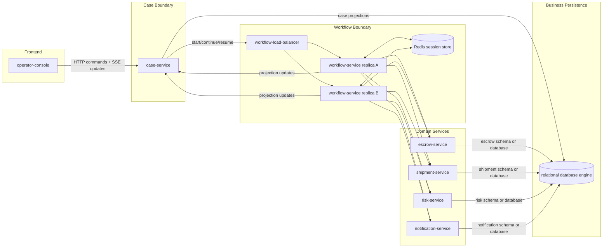
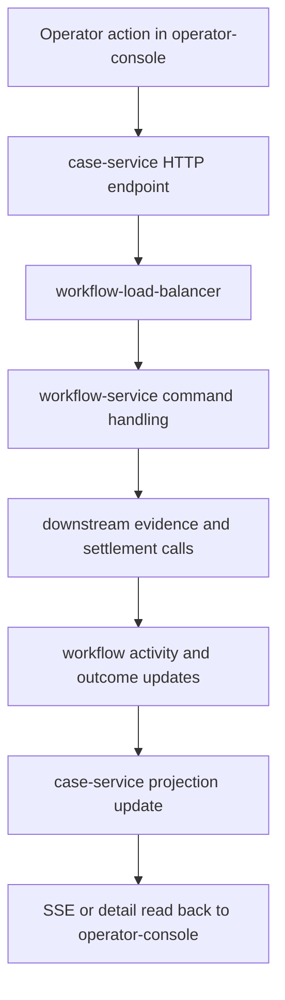

# Marketplace Agent Platform Architecture

This note separates architecture decisions from the sample concept.

Use [concept.md](/home/akring/arachne/samples/marketplace-agent-platform/docs/concept.md) to describe what the sample is meant to demonstrate.
Use this file to describe how the sample should be structured and run.
Use [apis.md](/home/akring/arachne/samples/marketplace-agent-platform/docs/apis.md) for minimal API boundaries and shared contract direction.
Use [contracts.md](/home/akring/arachne/samples/marketplace-agent-platform/docs/contracts.md) for case and approval contract direction.
Use [slices.md](/home/akring/arachne/samples/marketplace-agent-platform/docs/slices.md) for recommended implementation sequencing.
Use [skills.md](/home/akring/arachne/samples/marketplace-agent-platform/docs/skills.md) for service-local skill and knowledge boundaries.

The architecture is intentionally split into two views:

1. execution architecture
2. development architecture

That separation matters because the sample is trying to demonstrate a realistic distributed shape without committing too early to an unnecessarily heavy local development setup.

## Architectural Intent

The sample should demonstrate a marketplace platform where service boundaries and agent boundaries reinforce each other.

Architecture should make these points clear:

- each backend service owns its own local state and its own service-local agent
- cross-service collaboration happens through explicit backend contracts, not through one shared global prompt
- operator interaction happens through a thin frontend and a case-facing boundary
- correctness-sensitive state transitions remain deterministic inside backend services
- security and transaction boundaries remain owned by Spring application services, not by free-form model output
- availability is demonstrated through shared-state workflow continuity rather than sticky single-instance ownership

## Execution Architecture

Execution architecture describes the runtime topology of the sample when it is running.

The runtime shape below is the quickest way to review the service boundaries, communication paths, and shared infrastructure in one pass.

### Runtime Topology

The target runtime topology is:

- `operator-console`
- `case-service`
- `workflow-load-balancer`
- `workflow-service`
- `escrow-service`
- `shipment-service`
- `risk-service`
- `notification-service`

In the availability-focused slice, `workflow-service` is expected to run as multiple replicas behind the internal load balancer.

For the first runnable slice, that means exactly two workflow-service replicas behind one local load-balancer entry point.

`notification-service` is part of the first runnable slice as its own runtime rather than as an in-process simplification inside another service.

### Frontend Role

`operator-console` is not the subject of the sample. It is a visibility and control surface.

Its responsibilities are limited to:

- case list display
- agentic case search
- case detail display
- operator chat entry
- approval submission
- live activity updates derived from streaming events

It should not own business workflow logic.

For the first slice, `agentic case search` remains case-service-owned rather than being split into a dedicated search-oriented service.

### Backend Roles

`case-service`

- case creation entry point
- case-facing CRUD and query API owner for operator workflows
- case list, case detail, and search owner
- durable projection owner for activity history, approval state, and outcome views
- operator identity and authorization context entry point
- internal caller of workflow start, continue, and resume commands

`workflow-service`

- workflow entry point for internal case commands
- chat-oriented orchestration boundary
- Arachne session ownership for case workflows
- skill activation and policy/runbook consultation
- downstream service delegation
- recommendation production
- approval pause and resume control
- projection updates back into case-service

`escrow-service`

- escrow and settlement state
- refund, hold, and release execution
- deterministic settlement audit records
- transaction owner for settlement-changing actions

`shipment-service`

- shipment milestones
- delivery evidence interpretation
- shipping-exception summaries

`risk-service`

- fraud and compliance indicators
- threshold checks
- manual review triggers
- authorization-relevant escalation signals

`notification-service`

- operator-facing and participant-facing notification dispatch
- post-decision delivery status
- notification work kept separate from settlement transaction ownership

### Persistence Boundary

Business persistence should make service ownership visible rather than hiding it behind one generic platform database.

The architecture should preserve these rules:

- `case-service` persists only operator-facing case projections and case-facing workflow views
- `escrow-service` persists escrow and settlement business truth
- `shipment-service` persists shipment facts and shipment evidence records it owns
- `risk-service` persists risk review and threshold-related records it owns
- `notification-service` persists notification delivery records it owns
- `workflow-service` does not become the durable owner of business truth; its continuity store is Redis session state

For the first slice, business persistence remains relational.

The preferred local shape is one relational database engine with service-separated schemas or logical databases:

- case-service schema or database for case projections
- escrow-service schema or database for escrow and settlement state
- shipment-service schema or database for shipment evidence state
- risk-service schema or database for risk review state
- notification-service schema or database for notification delivery state

That keeps the local runtime simple while still making domain-service ownership explicit.

### Agent Placement

Each backend service owns one named Arachne agent.

Recommended mapping:

- `case-service` -> `case-agent`
- `workflow-service` -> `case-workflow-agent`
- `escrow-service` -> `escrow-agent`
- `shipment-service` -> `shipment-agent`
- `risk-service` -> `risk-agent`
- `notification-service` -> `notification-agent`

This mapping should stay explicit. The sample should not blur service boundaries by hiding several service concerns behind one agent.

### Communication Shape

The current architectural direction is:

The communication contract can also be read as a single path from operator input to final projection update.

- frontend to case-service commands: HTTP
- frontend to case-service live activity updates: SSE
- case-service to workflow-service: synchronous internal workflow commands through `workflow-load-balancer`
- workflow-service to backend domain services: synchronous service-to-service API calls in the first slice
- workflow-service to case-service: explicit projection and activity updates
- approval submission to case-service: explicit API call forwarded into the workflow resume path

The first slice should prefer the simplest communication model that still makes the distributed shape visible.

For the first slice, this makes HTTP plus SSE the preferred frontend communication model over WebSocket.

### Security Boundary

Security should be modeled as part of the core runtime shape, not as an afterthought.

The architecture should preserve these rules:

- operator identity enters through the frontend and case-service boundary
- case-service forwards the relevant operator context into workflow handling
- delegated backend work receives the relevant operator context through explicit propagation from workflow-service
- service-local mutation checks remain deterministic and Spring-owned
- approval does not replace authorization; both must be satisfied where required

The first slice does not need full enterprise identity integration, but it should clearly model authenticated operators and authority-based action control.

### Session Boundary

`workflow-service` should own the case session lifecycle.

This means:

- workflow commands attach to a case session id
- approval pause and resume are case-session aware
- workflow progress is associated with the current case and then projected into case-service

This session state should be externalized to a shared persistence layer so workflow-service replicas can continue the same case through the internal load-balanced entry point.

The selected shared session store for the sample is Redis.

`case-service` should remain durable from the operator-facing projection point of view, but it does not own Arachne workflow session state.

Other services may remain stateless from the Arachne session perspective even if they maintain their own business state.

Business data storage remains separate from session persistence.

- Redis backs shared workflow session continuity
- relational database storage backs service-owned business records and case-service-owned projections
- one local relational database engine is acceptable for the sample as long as service ownership remains separated by schema or logical database

### Availability Boundary

Availability should be demonstrated through replica-safe workflow behavior rather than through artificial failure choreography.

The architecture should preserve these rules:

- `workflow-service` instances are horizontally replaceable from the workflow point of view
- shared session persistence holds the case workflow and conversation state needed for continuation
- internal load balancing may route successive workflow requests for the same case to different workflow-service instances
- sticky sessions are not required for normal workflow progression

For this sample, the shared session persistence layer is Redis and is part of the intended availability story rather than an optional later substitution.

The sample does not need to simulate instance failure to prove this point. It is enough to show that the load-balanced path works correctly across workflow-service replicas.

### Transaction Boundary

Transaction ownership should remain inside deterministic backend services.

The architecture should preserve these rules:

- `workflow-service` orchestrates but does not own settlement transactions
- `escrow-service` owns transaction boundaries for refund, release, and hold-changing operations
- read-only review paths such as shipment and risk inspection remain outside mutation transactions where practical
- notification behavior remains separated from the core settlement mutation boundary unless an explicit design reason requires coupling

This boundary is important because the sample is meant to show enterprise backend discipline, not only agent collaboration.

### Streaming Boundary

Streaming should be exposed as case-visible activity updates.

The sample should not expose raw low-level model protocol events directly to the user when a clearer activity entry can be produced.

Expected transformation path:

- Arachne stream event
- workflow-service activity event
- case-service projection update
- frontend-readable case activity item

### Approval Boundary

Approval should be visible as a first-class workflow state.

The architecture should preserve these rules:

- approval interrupts before deterministic settlement action
- the paused state is queryable from the case detail view
- resume happens through an explicit case-service endpoint that re-enters the existing Arachne resume path inside workflow-service

For the first slice, the approval actor is `finance control`.

## Development Architecture

Development architecture describes how the sample is laid out in source control and how contributors build and run it locally.

### Repository Layout Direction

The sample should become a multi-module project under its sample directory.

Recommended shape:

- parent aggregator module
- `shared-contracts`
- `shared-policy-resources`
- `operator-console`
- `case-service`
- `workflow-service`
- `escrow-service`
- `shipment-service`
- `risk-service`
- `notification-service`
- optional `integration-tests`

This shape keeps shared types explicit while avoiding one giant backend module.

### Shared Modules

`shared-contracts`

- case records
- evidence summary types
- approval command and response types
- settlement outcome types

The initial API surface and contract direction are described in [apis.md](/home/akring/arachne/samples/marketplace-agent-platform/docs/apis.md).

`shared-policy-resources`

- allowlisted runbooks
- settlement policy documents
- approval threshold references

This separation helps avoid mixing domain contracts with packaged content.

### Frontend Development Shape

The frontend should stay lightweight.

The selected first-slice frontend stack is `React + TypeScript + Vite`.

This choice is preferred because it keeps the operator console thin while still giving straightforward support for:

- case-facing HTTP command APIs
- case-facing SSE activity updates
- a two-screen UI with modest client-side state
- fast local iteration for a separately runnable frontend

The stack should still preserve these constraints:

- minimal dependency footprint
- easy local startup
- clear API boundary to case-service
- no business logic duplication from the backend

The frontend should remain intentionally small enough that replacing the stack later would not force a backend redesign.

### Local Run Strategy

The likely local run target is Docker Compose, but only after the module structure is stable.

The first runnable slice should define two local run modes:

1. composed demo mode
2. focused development mode

Expected role of Compose:

- start all sample services consistently
- start workflow-service replicas and the internal load balancer consistently
- connect frontend and backend endpoints
- provide shared infrastructure such as Redis and the relational database

Before Compose is introduced, individual services should still be runnable for focused development.

### Composed Demo Mode

The first runnable slice should have one primary local demo shape driven by Docker Compose.

That composed runtime should include:

- `operator-console`
- `case-service`
- `workflow-load-balancer`
- two `workflow-service` replicas
- `escrow-service`
- `shipment-service`
- `risk-service`
- `notification-service`
- `Redis` for shared workflow session persistence
- one relational database engine for business data persistence

For the local runtime story, `workflow-load-balancer` should be a lightweight reverse proxy container that fronts the workflow-service replicas for internal workflow commands.

`nginx` is the preferred first-slice implementation because it keeps the local story concrete without pulling in a larger platform concern than the sample needs.

The relational database does not need to imply a shared business ownership model.
The local composed runtime may use one database engine instance while still preserving service-local ownership through separate schemas or separate logical databases per service.

### Focused Development Mode

The local architecture should also support targeted work without requiring the full composed runtime on every change.

Focused development mode should allow:

- running `case-service` directly from the IDE or Maven
- running an individual backend service directly from the IDE or Maven
- running a single workflow-service instance directly when replica behavior is not the subject of the task
- running the `operator-console` through the Vite development server when working on the thin frontend in isolation
- connecting that directly run service to the same local Redis and relational database infrastructure when needed
- starting only the dependent services relevant to the current change rather than the full platform stack

This keeps day-to-day development lighter while preserving one canonical composed runtime for the sample demonstration.

### Testing Strategy Direction

Testing should follow the architecture split.

Implementation sequencing and validation checkpoints are described in [slices.md](/home/akring/arachne/samples/marketplace-agent-platform/docs/slices.md).

Recommended layers:

- service-local tests inside each module
- case-service API and projection tests
- workflow-service orchestration tests at the workflow boundary
- service-local authorization and transaction tests for mutation paths
- optional end-to-end sample tests across the composed runtime

The sample should avoid requiring full multi-service startup for every small backend test.

## Deferred Decisions

No deferred architecture decisions remain at the current concept-document level.